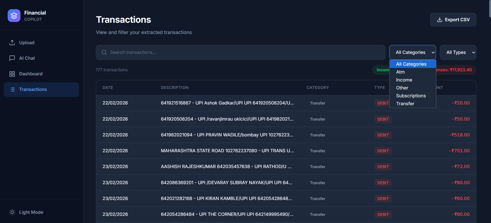
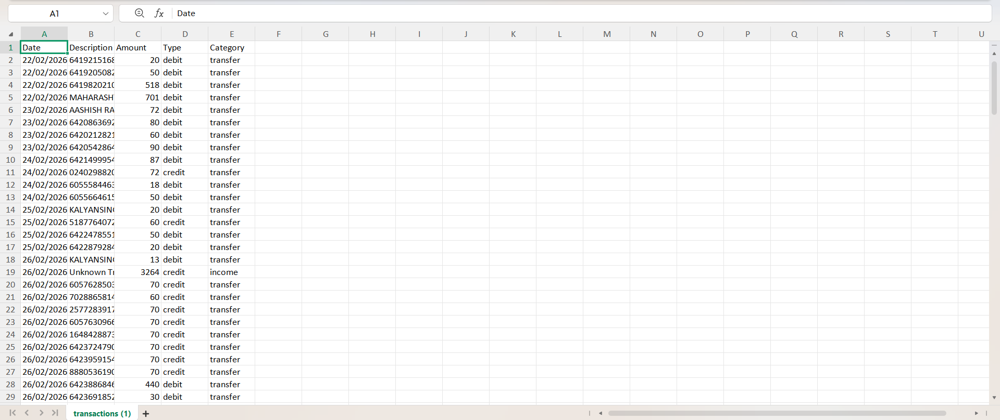

<div align="center">

# 🤖 AI Financial Copilot

**Upload bank statements. Chat with AI. Master your finances.**

[](https://angular.dev)
[](https://fastapi.tiangolo.com)
[](https://groq.com)
[](https://tailwindcss.com)
[](LICENSE)

A full-stack AI-powered web app that extracts transactions from bank statement PDFs and lets you chat with an AI assistant about your finances — complete with interactive dashboards and smart insights.

</div>

---

## 📸 Screenshots

### Upload Statement


### AI Chat


### Financial Dashboard


### Transactions


---

## ✨ Features

| Feature | Description |
|---|---|
| 📄 **PDF Upload** | Drag-and-drop bank statement upload with auto-parsing |
| 🤖 **AI Chatbot** | RAG-powered chat using Groq AI (Llama 3.3 70B) |
| 📊 **Dashboard** | Interactive Chart.js charts — doughnut, bar, line |
| 📋 **Transactions** | Searchable, filterable table with CSV export |
| 🌗 **Dark/Light Mode** | Persistent theme toggle |
| ⚠️ **Unusual Spending** | Auto-detects outlier transactions |
| 📝 **Logging** | Request IDs, timestamps, execution timing |
| 🇮🇳 **Indian Banks** | Supports Kotak, SBI, HDFC, ICICI statement formats |

---

## 🏗️ Tech Stack

| Layer | Technology |
|---|---|
| **Frontend** | Angular 19, Tailwind CSS v4, Chart.js |
| **Backend** | Python, FastAPI, Pydantic |
| **AI/LLM** | Groq API, Llama 3.3 70B Versatile |
| **PDF Parsing** | pdfplumber |
| **Architecture** | RAG (Retrieval-Augmented Generation) |

---

## 📁 Project Structure

```
New-Finance-Helper/
├── backend/
│   ├── app/
│   │   ├── main.py                  # FastAPI entry point
│   │   ├── config.py                # Environment config
│   │   ├── logger.py                # Logging system
│   │   ├── models.py                # Pydantic schemas
│   │   ├── pdf_parser.py            # PDF text extraction
│   │   ├── transaction_processor.py # Text → structured data
│   │   ├── rag_engine.py            # RAG + Groq AI chatbot
│   │   ├── insights.py              # Financial analytics
│   │   └── routes/
│   │       ├── upload.py            # POST /upload-pdf
│   │       ├── transactions.py      # GET /transactions
│   │       ├── chat.py              # POST /chat
│   │       └── insights.py          # GET /insights
│   ├── requirements.txt
│   └── .env.example
├── frontend/                        # Angular 19 app
│   └── src/app/
│       ├── pages/
│       │   ├── upload/              # PDF upload page
│       │   ├── chat/                # AI chatbot page
│       │   ├── dashboard/           # Financial dashboard
│       │   └── transactions/        # Transactions table
│       └── services/
│           ├── api.service.ts       # HTTP client
│           └── theme.service.ts     # Dark/light mode
├── screenshots/
├── .gitignore
└── README.md
```

---

## 🚀 Getting Started

### Prerequisites

- **Python 3.10+**
- **Node.js 18+** & **npm**
- **Groq API Key** — [Get one free →](https://console.groq.com)

### 1️⃣ Backend Setup

```bash
cd backend

# Create & activate virtual environment
python -m venv venv
venv\Scripts\activate        # Windows
# source venv/bin/activate   # macOS/Linux

# Install dependencies
pip install -r requirements.txt

# Configure environment
copy .env.example .env       # Windows
# cp .env.example .env       # macOS/Linux
```

> ⚠️ **Edit `backend/.env`** and replace `gsk_your_key_here` with your actual Groq API key.

```bash
# Start the server
uvicorn app.main:app --reload --port 8000
```

### 2️⃣ Frontend Setup

```bash
cd frontend

# Install dependencies
npm install

# Start dev server
ng serve
```

### 3️⃣ Open the App

```
http://localhost:4200
```

---

## 🔑 Environment Variables

| Variable | Required | Default | Description |
|---|---|---|---|
| `GROQ_API_KEY` | ✅ Yes | — | Your Groq API key |
| `GROQ_MODEL` | No | `llama-3.3-70b-versatile` | AI model to use |
| `CORS_ORIGINS` | No | `http://localhost:4200` | Allowed frontend origins |

---

